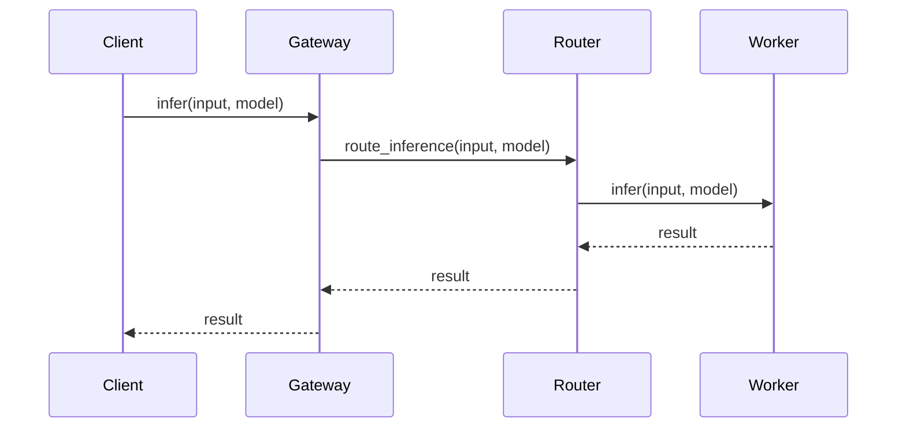
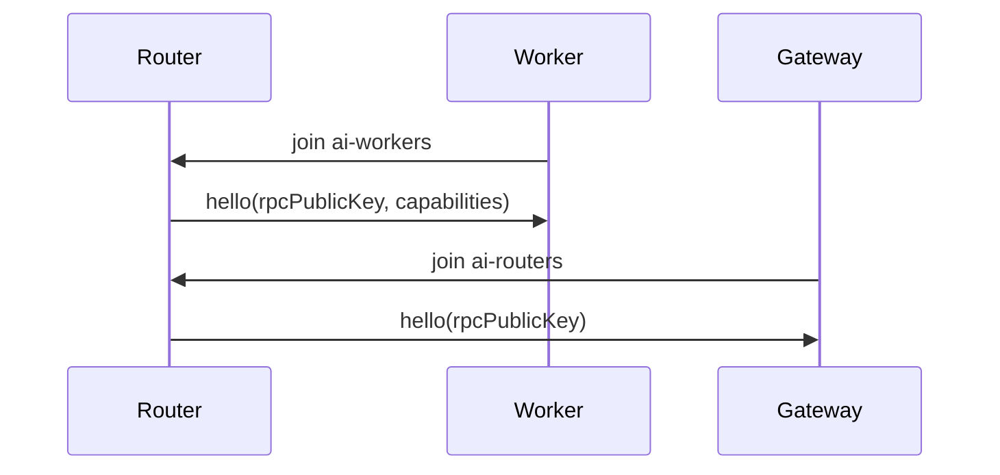
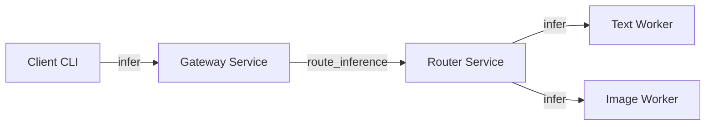
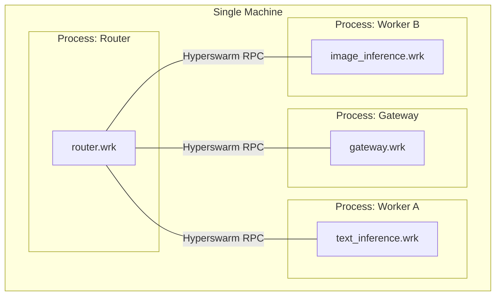

# Architecture

## Overview

This repository implements a skeleton AI inference platform on top of Hyperswarm RPC using a worker-based microservice architecture. The system is intentionally small but explicitly demonstrates decentralized service discovery, routing, fault tolerance, and horizontal scaling.

### Components

- Client CLI: sends inference requests to the Gateway via Hyperswarm RPC.
- Gateway: validates requests, forwards them to a Router, returns results to the client.
- Router: discovers workers, selects a suitable worker, handles retries/failover.
- Model Workers: stateless inference workers (text and image) that execute local models.

## Request Flow

```
Client -> Gateway -> Router -> Worker -> Router -> Gateway -> Client
```

### Example Flow

```
[client.js] --infer--> [gateway.wrk] --route_inference--> [router.wrk]
    -> select worker (ai-workers) -> [text_inference.wrk]
    <- result <- router <- gateway <- client
```

## User Flow Diagrams

### Sequence (Inference Request)



### Discovery (Join + Hello)



### Component Graph



### Deployment Topology (Local)



## Decentralized Service Discovery

- Services join Hyperswarm topics and exchange discovery "hello" messages over swarm connections.
- Router + workers join `ai-workers` for worker discovery.
- Gateway + router join `ai-routers` for router discovery.
- Hello messages carry `rpcPublicKey` and `capabilities`, allowing peers to build registries without centralized coordination.

```
ai-workers topic: Router <-> Text/Image Workers
ai-routers topic: Gateway <-> Router(s)
```

## Worker Orchestration and Routing

- `WorkerRegistry` tracks connected workers, capabilities, and health signals.
- Router selects workers by model capability using round-robin or random selection.
- Router issues RPC requests to workers and returns responses upstream.

## Local Model Execution

- AI models are executed **locally within the worker process**.
- Text workers host `sentiment` and `uppercase` models.
- Image workers host `embedding` models.

## Fault Tolerance and Resilience

- RPC requests use timeouts and retries (`rpcTimeoutMs`, `rpcRetries`).
- Router tracks per-worker failure counts and removes unhealthy workers.
- Swarm disconnect events remove workers/routers from registries.
- When a worker fails, Router retries the request with another worker.

## Horizontal Scalability

- Workers are stateless and can be scaled horizontally by running more processes.
- All workers join the same topic; Router automatically discovers and distributes requests.
- Multiple Router instances can be deployed; Gateway discovers routers via the swarm.

## Data Storage Strategy and Replication Plan

- **Current state:** No persistent data is required for inference; workers are stateless.
- **Local storage use:** The existing store facility is kept available for future extensions (metrics, caching, durable logs).
- **Replication plan (future):** If we add model metadata or routing state, replicate it via a CRDT log or append-only feed.
- **Replication plan (future):** Worker metadata could be stored in per-topic logs replicated across routers for fast restarts.
- **Replication plan (future):** Large model artifacts can use a content-addressed store and be pinned by workers.

## Scalability and Robustness Plan

- **Load scaling:** Add more worker processes; router balances requests across discovered workers.
- **Fault tolerance:** timeouts, retries, and worker failure tracking prevent single-node failure from blocking the system.
- **Sharding strategy (future):** Shard by model name or capability, e.g. `ai-workers-text`, `ai-workers-image`.
- **Sharding strategy (future):** Routers can maintain per-shard registries and route based on model type.
- **Router scaling:** multiple routers can run in parallel; gateway discovers and uses any healthy router.

## Observability

- Structured logging via `pino` captures startup, discovery, routing, and errors.
- Logs are designed to trace distributed request flow end-to-end.
